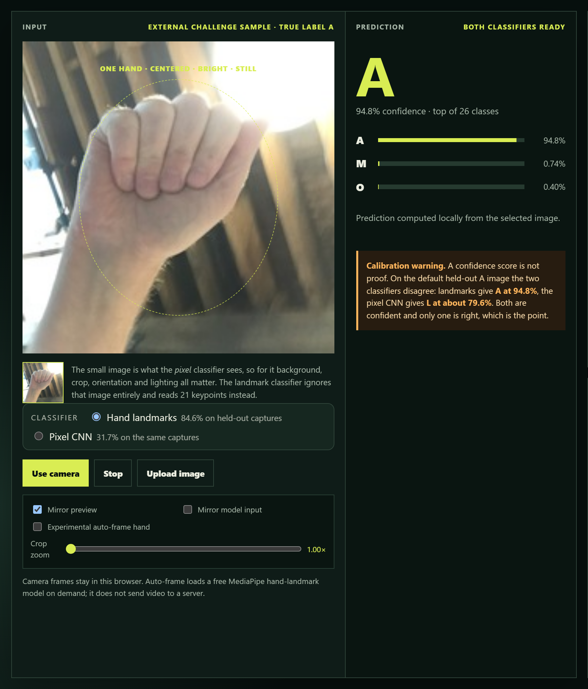

# ASL Alphabet Image Classifier

A reproducible computer-vision pipeline for classifying isolated A-Z American Sign Language
alphabet images, with checksummed data manifests, two released models that read the same signs
differently, independent-domain evaluation, command-line inference, and an optional local demo.

**Project website:** [ssavan99.github.io/sign-language-recognition](https://ssavan99.github.io/sign-language-recognition/) — free local browser inference with an optional camera or image upload.



The screenshot is the live website classifying a held-out capture whose true label is **A**. Both
released models run in the browser and they disagree on this image: the landmark classifier reads
**A** at 94.8%, while the pixel CNN reads **L**. That disagreement is the project's central finding.
Reading hand geometry scores **84.62%** on held-out captures from a separate source; reading pixels
scores **31.67%** on the same images, despite 98.92% on its own corpus. This remains an
isolated-image experiment, not a real-world signing or accessibility system.

## What the project includes

- Deterministic discovery of A-Z image folders, including pooled and source-provided train/test
  layouts.
- Checksummed CSV manifests with exact-duplicate grouping, cross-split refusal, and bounded dHash
  review reporting.
- A 164,546-parameter compact CNN with separate training and deterministic evaluation transforms.
- Self-describing checkpoints containing architecture, class order, preprocessing, seed, manifest
  hashes, and selection metadata.
- Bounded-memory evaluation with per-class metrics, confusion matrices, artifact hashes, and
  single-image latency.
- Shared inference for the CLI and optional local Gradio upload/webcam interface.
- A generated-data smoke workflow and 26-test suite that require no dataset download.
- Preserved historical notebooks, figures, and report under [`archive/`](archive/README.md).

## Results

| Experiment | Evaluation scope | Images | Accuracy | Macro F1 |
| --- | --- | ---: | ---: | ---: |
| Historical reported CNN | Same-corpus image holdout; unseeded historical workflow | Not retained in a manifest | 94.27% | Not reported |
| Previous compact CNN | Untouched test partition from the training corpus | 15,600 | 99.82% | 99.82% |
| Previous compact CNN | Separate external capture source | 780 | 17.56% | 16.82% |
| Maintained compact CNN | Untouched test partition from the training corpus | 15,600 | 98.92% | 98.93% |
| Maintained compact CNN | Separate external capture source | 780 | 31.67% | 31.74% |
| Landmark classifier | Separate external capture source, reserved half | 390 | **84.62%** | 86.32% |

The maintained model classified 15,432 of 15,600 internal test images correctly, but only 247 of
780 external images. The 67.25 percentage-point gap is evidence of severe capture-domain bias.

A second classifier reads hand geometry rather than pixels. MediaPipe supplies 21 hand keypoints;
normalising away position, scale, in-plane rotation, and handedness leaves a description of hand shape
that carries nothing about how the photograph was taken. On held-out captures from a separate source it
scores **84.62%** against the pixel model's 31.67%, counting an undetected hand as a wrong answer. It has
57,498 parameters and trains in 98 seconds. Details, including why it scores *lower* on the primary corpus
than on external photographs, are in [docs/results/robustness.md](docs/results/robustness.md).

External accuracy nearly doubled, from 17.56% to 31.67%, for a 0.90-point cost on the same-corpus
test. The gain came from changing the training-augmentation recipe alone; architecture, image size,
seed, optimizer, and the inference preprocessing contract are unchanged. The experiment, its
pre-registered decision rule, and the candidates that lost are documented in
[docs/results/robustness.md](docs/results/robustness.md). Two of every three external images are
still classified incorrectly, so this remains a demonstration of domain shift, not a deployable
system.
Internal performance must not be interpreted as signer-independent or real-world accuracy.

The released checkpoint uses 64 x 64 RGB inputs, three convolutional blocks, AdamW, seed 42, and
12 CPU training epochs. Its SHA-256 is
`ea9208df33b76843ac24eac2188dcce809da3e609629914e99024eb14ba7727e`.
See the [current result report](docs/results/current/README.md), [model card](models/README.md), and
[historical archive](archive/README.md) for the full evidence and comparability boundaries. The
broken two-class transfer-learning notebook's near-perfect metric is excluded from supported
26-class results.

## How it works

1. A data root is discovered through a bounded wrapper hierarchy and must contain every A-Z class.
2. Each image is recorded with its relative path, label, split, SHA-256, and 64-bit dHash.
3. Exact-content groups stay in one generated split; exact duplicates across source-provided
   partitions are rejected rather than silently moving test data.
4. Training uses augmentation, while validation, evaluation, and inference use deterministic
   resizing and ImageNet normalization.
5. Every manifest row is rechecked against the current file bytes before training or evaluation.
6. The best-validation-loss checkpoint drives CLI prediction, evaluation, and the local demo.

## Install

Python 3.10-3.12 is supported; Python 3.10.11 is the fully verified environment. The following
PowerShell commands install the free CPU build and every optional data, demo, and development
dependency:

```powershell
py -3.10 -m venv .venv
.\.venv\Scripts\Activate.ps1
python -m pip install --upgrade pip setuptools wheel
python -m pip install torch==2.7.1 torchvision==0.22.1 --index-url https://download.pytorch.org/whl/cpu
python -m pip install -c constraints.txt -e ".[all]"
```

No account, API token, hosted notebook, paid API, subscription, or cloud service is required.
Platform-specific PyTorch builds may be substituted from the official PyTorch index.

Verify the environment:

```powershell
asl-recognition doctor
asl-recognition --help
ruff check --no-cache src tests tools
ruff format --check src tests tools
pytest --cov=asl_recognition --cov-report=term-missing --cov-fail-under=75
```

## Quick smoke run

This command generates a small synthetic A-Z dataset and runs preparation, one training epoch,
checkpoint export, evaluation, and prediction on CPU:

```powershell
asl-recognition smoke --output-dir artifacts/smoke --seed 42 --device cpu
```

The smoke result verifies integration only and is not a reported model score.

## Data

The maintained workflow uses two public Kaggle datasets:

| Purpose | Source | Publisher license | Maintained subset |
| --- | --- | --- | --- |
| Training and internal evaluation | [`grassknoted/asl-alphabet`](https://www.kaggle.com/datasets/grassknoted/asl-alphabet) | GPL-2.0 | A-Z images |
| External-domain evaluation | [`danrasband/asl-alphabet-test`](https://www.kaggle.com/datasets/danrasband/asl-alphabet-test) | CC0 | A-Z images |

The official `kagglehub` client downloaded both public sources anonymously during verification.
Acquire and prepare them from the repository root:

```powershell
asl-recognition download primary --output-root data/raw
asl-recognition prepare --source-root data/raw/primary --output-dir data/manifests --seed 42

asl-recognition download external --output-root data/raw
asl-recognition prepare-external --source-root data/raw/external --output-file data/manifests/external.csv
```

If a source later requires authentication or consent, stop the download and pass an existing local
directory to `--source-root`; do not enter credentials. Dataset files, manifests, and run outputs
remain ignored by Git. See [the data contract](docs/data.md) for accepted layouts and provenance.

## Train and evaluate

Train the maintained 64 x 64 configuration:

```powershell
asl-recognition train `
  --manifest-dir data/manifests `
  --source-root data/raw/primary `
  --output-dir artifacts/training `
  --epochs 12 `
  --batch-size 64 `
  --image-size 64 `
  --seed 42 `
  --device cpu
```

Evaluate the selected checkpoint on the untouched source test partition and the external source:

```powershell
asl-recognition evaluate `
  --checkpoint artifacts/training/best_model.pt `
  --manifest data/manifests/test.csv `
  --source-root data/raw/primary `
  --output-dir artifacts/evaluation/internal `
  --scope "same-corpus source test" `
  --device cpu

asl-recognition evaluate `
  --checkpoint artifacts/training/best_model.pt `
  --manifest data/manifests/external.csv `
  --source-root data/raw/external `
  --output-dir artifacts/evaluation/external `
  --scope "separate external capture source" `
  --device cpu
```

Training the recorded full-data CPU run took about two hours. CUDA is optional; an explicit
unavailable device request fails instead of silently changing the run.

## Predict one image

The repository includes the evaluated compact checkpoint and a CC0 external sample:

```powershell
asl-recognition predict docs/demo/sample_external_a.jpg `
  --checkpoint models/asl_alphabet_cnn_robust_seed42.pt `
  --top-k 3 `
  --device cpu
```

The deterministic sample result is L at approximately 76.2% confidence, despite its true A label.
The website reports about 79.6% for the same image and the same weights; the two resize the image
differently, which [docs/results/robustness.md](docs/results/robustness.md) explains.

## Local demo

Launch the optional upload/webcam interface on the loopback address:

```powershell
asl-recognition demo --checkpoint models/asl_alphabet_cnn_robust_seed42.pt --device cpu
```

Open the printed local URL. Public sharing and public prediction APIs are disabled. The built-in
external-domain example reproduces the screenshot and keeps the measured limitation visible even
when model confidence is high. See the [demo guide](docs/demo/README.md).

## Browser website

The free [GitHub Pages site](https://ssavan99.github.io/sign-language-recognition/) packages the
released checkpoint's exact weights for browser inference. It can classify an optional local
camera frame, an uploaded image, or one of 26 selected CC0 external-capture samples; those images
remain in the browser. The page also publishes its confusion matrices, exact evaluation counts,
and real CNN layer-response views rather than separating the evidence from the demo.

The camera panel provides visible framing, preview/model-mirroring, crop zoom, and an optional
client-side MediaPipe hand-landmark crop. The optional crop is deliberately labeled experimental:
it can improve framing but does not retrain the classifier or turn it into a reliable hand
detector. The page has the same isolated-still-image scope and external-domain limitation shown in
the evaluation report, and it is not an accessibility system.

## Repository structure

```text
src/asl_recognition/       Maintained data, model, training, evaluation, inference, and demo code
tests/                     Generated-data unit and integration tests
models/                    Released compact checkpoint and model card
docs/results/current/      Maintained evaluation report and confusion matrices
docs/demo/                 Local demo guide, CC0 sample, and real screenshot
site/                      GitHub Pages browser classifier and published evidence assets
tools/                     Browser-model export and parity verification scripts
archive/notebooks/         Preserved exploratory notebooks; not the supported run path
.github/workflows/         Free CI and GitHub Pages deployment workflows
```

## Limitations

- The task is isolated A-Z still-image classification, not continuous signing or sentence
  translation.
- The model is not a hand detector; the demo performs only basic image-quality checks.
- The primary dataset lacks signer and capture-session identifiers, so signer-disjoint and
  session-disjoint evaluation cannot be established.
- Same-corpus images share controlled backgrounds and capture conditions, producing optimistic
  internal results and many coarse perceptual-similarity review candidates.
- J and Z depend on motion in real signing; one frame cannot represent that motion fully.
- Softmax confidence is not calibrated proof of correctness. The external sample demonstrates a
  confident wrong prediction.
- The project has not been validated for real-world deployment or as an accessibility system.

## Licensing

Dataset files remain subject to their publishers' licenses listed above. No license is currently
provided for the project code.
