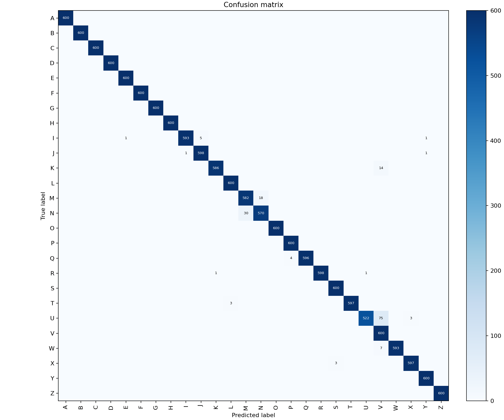
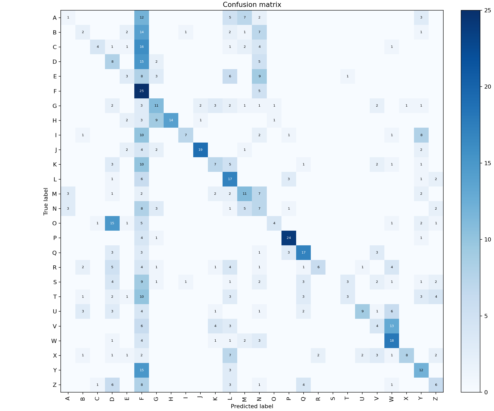

# Reproducible compact-CNN results

These results were produced by the maintained package on 2026-08-19. They are
reported separately because the internal and external evaluations answer very
different questions.

## Summary

| Evaluation | Images | Accuracy | Macro F1 | Interpretation |
| --- | ---: | ---: | ---: | --- |
| Internal source test | 15,600 | 98.92% | 98.93% | Same-corpus image holdout; optimistic |
| External source test | 780 | 31.67% | 31.74% | Separate capture source; still poor transfer |

The external result is the best evidence of practical behaviour. The 67.25
percentage-point gap shows the model remains strongly dependent on the primary
dataset's capture conditions, even though that dependence is now materially
weaker than it was.

### Change from the previous released model

| Evaluation | Previous | Current | Change |
| --- | ---: | ---: | ---: |
| Internal source test | 99.82% | 98.92% | -0.90 pts |
| External source test | 17.56% | 31.67% | **+14.10 pts** |
| Internal-to-external gap | 82.26 pts | 67.25 pts | -15.01 pts |

External accuracy nearly doubled for a 0.90-point cost on the same-corpus test.
On the external set, 18 of 26 classes improved, 6 regressed, and 2 were
unchanged; classes scoring zero recall fell from six (A, E, F, T, U, Z) to one
(S). The single largest gain was F, from 0% to 83.33%.

The change came from the training-augmentation recipe alone. Model architecture,
parameter count, image size, seed, optimizer, and the entire inference
preprocessing contract are unchanged, so the comparison isolates augmentation.
The experiment that produced this recipe, including its pre-registered decision
rule and the candidates that lost, is documented in
[../robustness.md](../robustness.md).

## Training contract

- Model: 164,546-parameter compact CNN.
- Input size: 64 x 64 RGB.
- Seed: 42.
- Augmentation profile: `robust_noflip`.
- Best-epoch selection metric: stress benchmark (`stress-v1`).
- Optimizer: AdamW, learning rate 0.001, weight decay 0.0001.
- Batch size: 64.
- Epochs: 12; best epoch 10.
- Training samples: 51,376.
- Validation samples: 11,024.
- Best validation loss: 0.0256703577.
- Validation accuracy at the selected epoch: 99.37%.
- Stress-benchmark accuracy at the selected epoch: 89.97%.
- Runtime: 3 h 46 min, CPU.
- Peak resident memory: 0.729 GiB.
- Environment: Python 3.10.11, PyTorch 2.7.1+cu118, NumPy 2.2.6,
  Windows 10 build 26200.

The source provided explicit train and test directories. The source test
partition was kept untouched. The source train partition was deterministically
split into train and validation groups, producing overall proportions of 65.87%
train, 14.13% validation, and 20.00% test.

Each manifest row records a relative path, label, split, SHA-256, and 64-bit
dHash. Model runs re-verified every source file against its SHA-256 before use.
The prepared splits contained zero exact cross-split duplicates. A dHash scan at
Hamming distance <= 5 produced 1,754,615 cross-split review candidates; this is
a coarse perceptual signal, not proof that every pair is a duplicate. The
source does not include signer or capture-session identifiers, so signer- and
session-independent grouping cannot be established.

Manifest hashes:

- Train:
  `f1e741d4c32ac356397af9c582b045362bcb687f6c3b0f1968d57a5bf243f23b`
- Validation:
  `dbc71fee51e0a1276901f8d7b2313fb2c46fdc6bfd1d4b9f99f23e7d3374fd56`
- Internal test:
  `4e6b56bc232f621df30cd3fceb43defc634f15bfe50a69ed5409128e0c744957`
- External test:
  `c1b79ff019139c695015a39c51cab817bc0c1f42878ea3cb4b51db0b4caffbc9`
- Duplicate report:
  `5fec8bb0ecb8e59720f6817993124c28630d46dfac197187e1147db2f1fcdc92`
- Stress-benchmark row set (`stress-v1`, 11,024 rows):
  `1d97daebc9b01dfda857324429eb31cca8300710f65e61c3d38078ede06d533c`

## Internal source test

The primary source test partition contains 600 images per class. The model
classified 15,432 of 15,600 images correctly. Class U had the lowest recall at
87.00%, followed by N at 95.00% and M at 97.00%.

Median single-image CPU model latency was 4.30 ms and p95 was 5.54 ms over 200
timed forward passes. This timing excludes image decoding, preprocessing, and
application overhead.

This score must not be interpreted as signer-independent or real-world
accuracy. Images come from the same controlled corpus as training data, and the
perceptual-candidate count indicates substantial visual similarity across the
image-level split.

## External source test

The external source contains 30 images per A-Z class from a separate capture
set. The model classified 247 of 780 images correctly. Macro F1 was 31.74%.
Class recall ranged from 0% for S to 83.33% for F, with P at 80.00% and J at
63.33%.

This is a real improvement over the previous 17.56%, and it is still a failure
to generalize reliably. Roughly two of every three external images are
classified incorrectly. Nothing here supports deployment.

The external data was downloaded anonymously from the public
`danrasband/asl-alphabet-test` dataset and was not used for training, model
selection, augmentation choice, or early stopping. It was scored exactly once,
after the candidate was already fixed. The A-Z subset is licensed CC0 according
to the source listing.

## Artifacts

- Model checkpoint:
  [`models/asl_alphabet_cnn_robust_seed42.pt`](../../../models/asl_alphabet_cnn_robust_seed42.pt)
- Per-epoch history: [`training_history.json`](training_history.json)
- Checkpoint SHA-256:
  `ea9208df33b76843ac24eac2188dcce809da3e609629914e99024eb14ba7727e`
- Training-history SHA-256:
  `bbd408af1080dba2fdcd00342e67d7153740221fdeafad507a4badcea93d68ca`
- Internal matrix SHA-256:
  `f562d9120d9f071893dfa5869e002b12a502403dd9d066c86760432287bce270`
- External matrix SHA-256:
  `0d77814b09955f58e3d4035a06a91c74be93b73189b998e670f4d6b2d328d7c4`

The full datasets, generated manifests, raw evaluation JSON, and local run
directories remain ignored because they are either large, machine-specific, or
reproducible from the documented commands.
